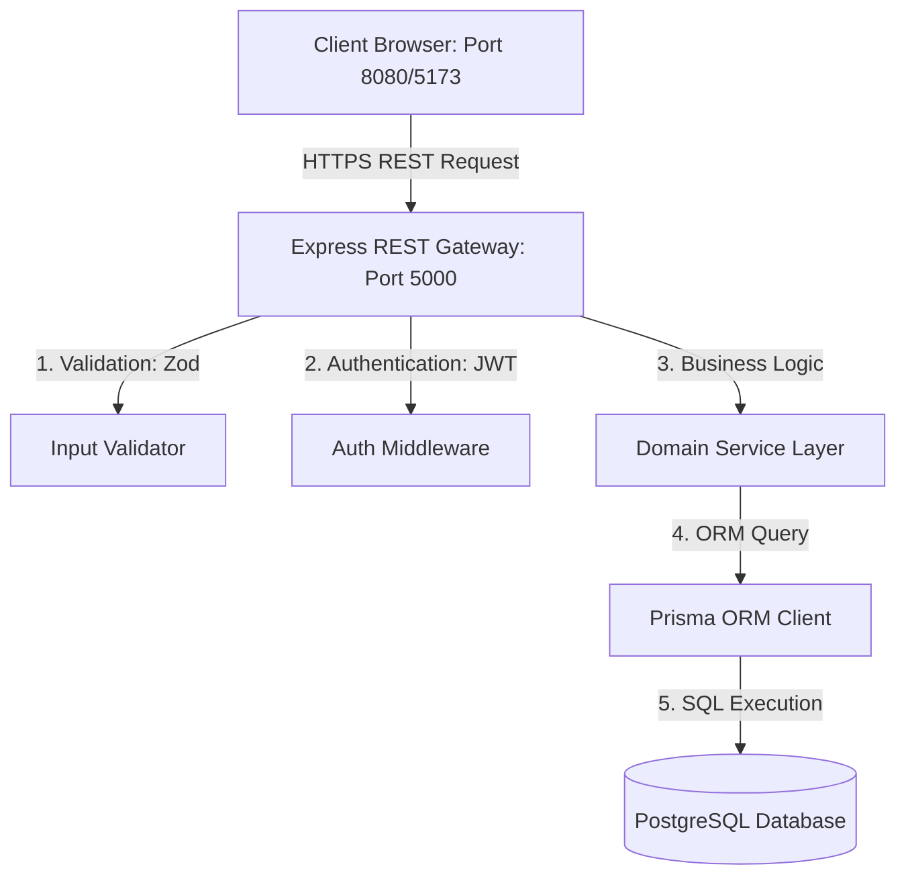
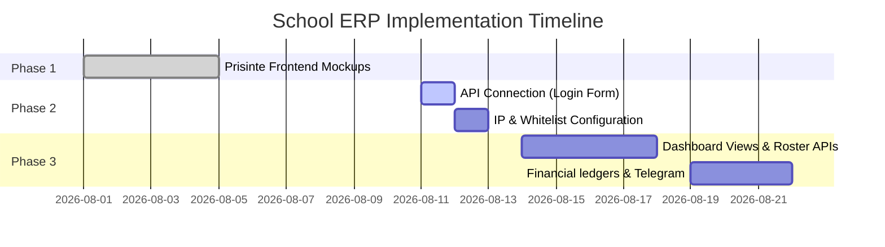

# Project Proposal - School ERP Platform
**Islamic Campus Portal & School Management System (SMS) Integration**

---

## 1. Executive Summary

This proposal outlines the vision, architecture, modules, and implementation plan for a modern, multi-tenant **School ERP Platform** designed specifically for Islamic centers, madrasas, and educational institutes. The system integrates a beautiful, public-facing school portal and information website with a comprehensive back-office management system (SMS) handling academic rosters, grading, finances, class scheduling, and Telegram notification gateways.

---

## 2. Vision and Objectives

The primary goal is to build a secure, modular, and enterprise-grade school management platform that:
*   **Centralizes Operations:** Links academic tracking, student ledger cards, invoicing, teacher rosters, and attendance records under a single source of truth.
*   **Supports Multi-Tenancy:** Structures data under an **Organization → Branch** hierarchy, allowing a single organization to manage multiple physical campuses.
*   **Elevates Communication:** Directs notifications to staff and guardians via Telegram bots and automated emails.
*   **Ensures Security & Privacy:** Utilizes robust JWT auth with session tracking and granular Role-Based Access Control (RBAC).

---

## 3. High-Level System Architecture

The platform is designed around a decoupled, domain-driven architecture to enforce clean separation of concerns and low coupling.

### Architectural Tiers:
1.  **Frontend Layer (Vite + React + Tailwind + TanStack):**
    *   *Public Portal (Port 8080):* Main entrance website, information pages, and secure staff sign-in interface.
    *   *Management Dashboard (Port 5173):* Dedicated React SPA for school administration and teaching staff to track day-to-day operations.
2.  **API Gateway Layer (Express + TypeScript):** Thin controllers handling HTTP mapping and payload validation.
3.  **Application Domain Layer:** Fully isolated business logic engines (Services & Repositories).
4.  **Database & Persistence Layer (Prisma ORM + PostgreSQL):** Relational schema supporting transactional updates, automated migrations, and schema-safe queries.

---

## 4. Key Functional Modules

### 📂 Organization & Branch Management
*   **Multi-Branch Isolation:** Allows branches to manage their own rosters, classes, financial transactions, and timetables while sharing global settings (e.g. currency, logo, and branding) defined at the parent Organization level.
*   **Status Toggles:** Ability to activate or suspend branches and organizations instantly.

### 🎓 Academic Administration
*   **Academic Calendars:** Dynamic management of school years (e.g. `2025/2026`) and terms (e.g. `First Semester`).
*   **Classrooms & Subjects:** Defining classrooms (room numbers/locations) and subjects linked to specific branches.
*   **Teacher Assignments:** Mapping teaching staff to specific subjects and class schedules.
*   **Student Enrollments:** Registering students, tracking enrollment history, and managing active class registries.

### 💰 Financial Management
*   **Fee Structures:** Creating custom tuition fee category profiles (e.g., "Monthly Tuition", "Admission Fee").
*   **Billing & Invoices:** Automatic invoicing of registered students based on course enrollment.
*   **Payments & Payroll:** Ledger recording cash or bank transfers, salary payment profiles, and payroll distributions for teachers.
*   **Ledgers:** Consolidated revenue and expense ledgers generating real-time cashflow analytics.

### 🤖 Telegram Bot Gateway
*   **Auto-linking:** Staff and students link their Telegram profiles using a 6-digit dynamic code generated by the portal.
*   **Instant Notifications:** Auto-sends announcements, grade reports, and payment reminders directly to Telegram.

---

## 5. Security & RBAC Design

The platform enforces the **Principle of Least Privilege** using Role-Based Access Control:

*   **User Sessions:** Stores active user agent, IP address, and login history in a `UserSession` table.
*   **JWT Handshake:** 
    *   `accessToken`: Transmitted via `Authorization: Bearer <JWT>` header for all authenticated actions (expires in 15 minutes).
    *   `refreshToken`: Kept in secure cookies/localStorage for silent token renewal without prompts (expires in 30 days).
*   **RBAC Mapping:**
    *   **Users** are assigned one or more **Roles** (`SUPER_ADMIN`, `ADMIN`, `TEACHER`, `STUDENT`).
    *   Each **Role** is bound to specific **Permissions** (e.g. `user:create`, `timetable:read`, `invoice:update`).

---

## 6. Documented API Specifications

Below is the structured API contract based on the official system Postman collection:

### 🔐 Authentication API

| Method | Endpoint | Request Body | Description |
| :--- | :--- | :--- | :--- |
| **POST** | `/api/auth/login/` | `{ username, password }` | Authenticates user, issues tokens. |
| **POST** | `/api/auth/refresh/` | `{ refreshToken }` | Renews expired access token. |
| **POST** | `/api/auth/logout/` | `{ refreshToken }` | Revokes specific user session. |
| **GET** | `/api/auth/me/` | *None (Requires JWT)* | Retrieves active user profile details. |
| **POST** | `/api/auth/forgot-password/` | `{ email }` | Sends password reset email. |
| **POST** | `/api/auth/reset-password/` | `{ token, newPassword }` | Resets password using email link token. |
| **PATCH** | `/api/auth/profile/` | `{ fullName, phone, address, etc. }` | Updates authenticated user profile details. |

### 🏢 Organization & Branch API

| Method | Endpoint | Request Body | Description |
| :--- | :--- | :--- | :--- |
| **POST** | `/api/organizations/` | `{ name, code, email, phone, website, address }` | Creates new tenant school organization. |
| **GET** | `/api/organizations/` | *None* | Lists all registered school organizations. |
| **PATCH** | `/api/organizations/:id/` | `{ name, code, logoUrl, phone, address }` | Updates organization profile details. |
| **DELETE** | `/api/organizations/:id/` | *None* | Permanently deletes an organization. |
| **POST** | `/api/branches/` | `{ organizationId, name, code, phone, email, address, isMainCampus }` | Creates campus branch under parent school. |
| **GET** | `/api/branches/` | *None* | Lists all branches. |
| **GET** | `/api/branches/organization/:orgId` | *None* | Gets branches belonging to a specific organization. |
| **PATCH** | `/api/branches/:id/` | `{ name, phone, email, isMainCampus }` | Updates branch details. |

### 👥 User Administration API

| Method | Endpoint | Request Body | Description |
| :--- | :--- | :--- | :--- |
| **POST** | `/api/users/` | `{ organizationId, email, roleIds[], profileData: { fullName, branchId, phone } }` | Provisions new user with roles and profile. |
| **GET** | `/api/users/` | *None* | Lists users across the branch. |
| **GET** | `/api/users/:id/` | *None* | Gets detailed user record. |
| **DELETE** | `/api/users/:id/permanent/` | *None* | Permanently deletes user from records. |
| **POST** | `/api/users/bulk/delete/` | `{ userIds[] }` | Soft-deletes multiple users. |

---

## 7. Implementation Roadmap

*   **Phase 1: Static Frontend Design (Complete):** Established clean, public-facing landing and mosque pages with dynamic language settings.
*   **Phase 2: Authentication Handshake (Current):** Linking the login form to the real Postgres JWT backend, establishing standard session routing.
*   **Phase 3: Deep Portal Integration (Next):** Fetching real academic lists, financial ledgers, and profile configurations using the branch and role endpoints.
